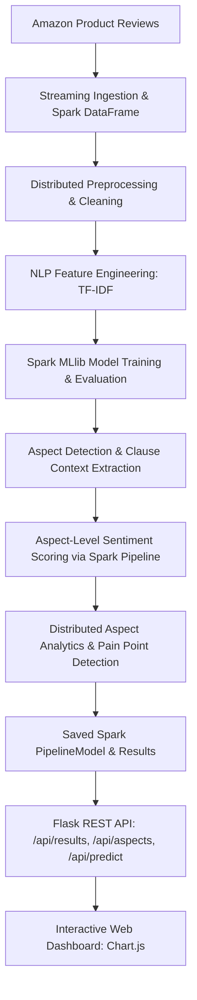
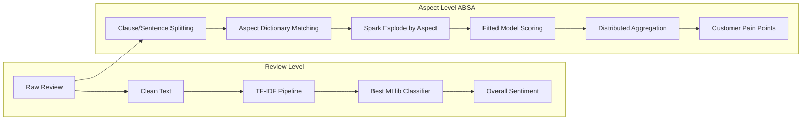

# Scalable Product Review Intelligence Using Apache Spark and Machine Learning

The project implements a scalable product-review sentiment classification, Aspect-Based Sentiment Analysis (ABSA), and business intelligence analytics system using Apache Spark and Spark MLlib.

The system processes large-scale Amazon product review datasets, performs distributed preprocessing and NLP feature extraction, trains multiple Spark MLlib classifiers, conducts empirical error analysis, performs fine-grained aspect detection and aspect-level sentiment classification, flags potential customer pain points, and serves both the trained model and aspect analytics through a Flask API and an interactive web dashboard.

---

## Project Architecture

### End-to-End System Architecture



### Sentiment & ABSA Processing Flow



---

## Project Structure

Current core project structure:

```
product-review-intelligence/
│
├── spark_pipeline.py            # Main Spark ML pipeline (training, evaluation, ABSA, export)
├── absa.py                      # Aspect-Based Sentiment Analysis module
├── api.py                       # Flask backend API & model serving
├── requirements.txt             # Python dependencies
├── results.json                 # Consolidated experiment results & ABSA analytics
├── saved_model/                 # Saved Spark PipelineModel (Tokenizer -> CountVec -> IDF -> Model)
│
└── results/
    ├── aspect_sentiment.csv     # Extracted aspect mentions, contexts, and sentiment scores
    └── figures/
        ├── model_accuracy_comparison.png
        ├── model_f1_comparison.png
        ├── model_roc_auc_comparison.png
        ├── model_train_time_comparison.png
        ├── sentiment_distribution.png
        ├── confusion_matrix_best_model.png
        ├── roc_curve_best_model.png
        ├── top_positive_terms.png
        ├── top_negative_terms.png
        ├── aspect_sentiment_distribution.png
        ├── aspect_negative_rate.png
        └── aspect_mentions.png
```

---

## Dataset

Dataset: **Amazon Polarity**

Loaded using Hugging Face datasets with streaming:

```python
load_dataset("amazon_polarity", split="train", streaming=True)
```

**Experimental Setup:**
- 200,000 reviews sampled from the streaming dataset
- 168,676 reviews after distributed cleaning and deduplication
- 80/20 train-test split (random seed = 42)

Amazon Polarity is a binary sentiment benchmark where:
- 1–2 star reviews → **Negative** (label 0)
- 4–5 star reviews → **Positive** (label 1)
- 3-star reviews are excluded to eliminate ambiguous ratings

---

## Spark Configuration

- `SparkSession`: `.master("local[*]")`
- Spark driver memory: `4g`
- Spark SQL shuffle partitions: `8`

`local[*]` instructs Spark to utilize all available local CPU cores for multi-threaded distributed processing. Spark DataFrames and MLlib pipelines leverage Spark's distributed execution engine, lazy evaluation, and query optimization even in local mode, without requiring code changes to scale to a multi-node cluster.

---

## Text Preprocessing

All preprocessing is performed in parallel on Spark DataFrames:

- **Remove missing reviews:** Ensures data integrity across Spark stages.
- **Remove duplicate reviews:** Eliminates data leakage and distribution skew.
- **Remove empty reviews:** Filters out noise and invalid inputs.
- **Convert text to lowercase:** Normalizes vocabulary tokens.
- **Remove non-alphanumeric characters:** Cleans punctuation, symbols, and HTML entities.
- **Normalize whitespace:** Collapses erratic spacing into uniform single spaces.
- **Calculate review length:** Extracts review word counts for structural and error analysis.

---

## Feature Engineering

**Unigram TF-IDF Pipeline:**
```
Tokenizer → StopWordsRemover → CountVectorizer (vocabSize=20,000, minDF=2.0) → IDF → Classifier
```

**Unigram + Bigram TF-IDF Pipeline:**
```
Tokenizer → StopWordsRemover → CountVectorizer (unigrams) → IDF
                             → NGram(n=2) → CountVectorizer (bigrams) → IDF
                             → VectorAssembler → Classifier
```
Unigram representations model individual terms independently, while bigrams capture local phrase dependencies (e.g., "not good").

---

## Machine Learning Models & Evaluation

The final repository run compared three Spark MLlib classifiers and selected the best performer using the measured benchmark values in `results/results.json`.

| Model | Feature Representation | Accuracy | Precision | Recall | F1 | ROC-AUC | Training Time | Prediction Time |
|---|---|---:|---:|---:|---:|---:|---:|---:|
| Naive Bayes | Unigram TF-IDF | 0.7644 | 0.7645 | 0.7644 | 0.7642 | 0.8377 | 0.75 s | 0.27 s |
| **Logistic Regression** | Unigram + Bigram TF-IDF | **0.7660** | **0.7662** | **0.7660** | **0.7661** | **0.8347** | **4.79 s** | **0.48 s** |
| Random Forest | Unigram + Bigram TF-IDF | 0.6494 | 0.7400 | 0.6494 | 0.6083 | 0.7792 | 68.05 s | 0.47 s |

**Selected Model:** Logistic Regression was the best model in the repository's final run based on the highest measured F1 score, 0.7661. The repository output uses this value as the benchmark winner for the generated results.

---

## Aspect-Based Sentiment Analysis (ABSA)

### Motivation

Traditional sentiment analysis answers:
> *"Is this review positive or negative overall?"*

Aspect-Based Sentiment Analysis (ABSA) answers:
> *"What specific product aspects are customers talking about, and what sentiment is expressed toward each aspect?"*

### Example

> **Customer Review:**  
> *"The battery life is terrible but the build quality is excellent."*
>
> - **Overall Sentiment:** Negative (or mixed)
> - **Aspect-Level Analysis:**
>   - **Battery:** Negative (Context: *"The battery life is terrible"*)
>   - **Build Quality:** Positive (Context: *"the build quality is excellent"*)

### Product Aspects & Domain Dictionaries

The ABSA module defines five configurable aspect dictionaries in `absa.py`:

1. **Battery:** `battery`, `battery life`, `charging`, `charger`, `charge`, `power`, `drains`, `charging speed`
2. **Build Quality:** `build`, `quality`, `material`, `durable`, `durability`, `plastic`, `metal`, `design`, `construction`
3. **Price / Value:** `price`, `cost`, `expensive`, `cheap`, `affordable`, `value`, `worth`, `money`
4. **Customer Support:** `support`, `customer service`, `service`, `representative`, `agent`, `help`, `response`, `refund`
5. **Delivery / Packaging:** `delivery`, `shipping`, `package`, `packaging`, `box`, `courier`, `arrived`, `delivery time`

### Scalable Implementation Details

1. **Sentence/Clause Context Extraction:** Reviews are split by punctuation and contrastive conjunctions (`but`, `however`, `although`, `yet`) to isolate aspect-specific clauses.
2. **Structured Aspect Output DataFrame:** Spark transforms the reviews into an exploded DataFrame with schema:
   `[review, aspect, context, sentiment, sentiment_score]`
   A single review discussing multiple aspects produces multiple distinct rows.
3. **Fitted Model Reuse:** Aspect contexts are passed through the existing fitted Spark MLlib `PipelineModel` for distributed scoring, avoiding the overhead of training separate models for each aspect.
4. **Distributed Aggregation:** Spark SQL aggregates total mentions, positive mentions, negative mentions, and negative feedback rates per aspect.
5. **Customer Pain Point Identification:** Aspects with significant mention volume and a negative feedback rate $\ge 40\%$ are automatically flagged as **Potential Customer Pain Points**.

---

## Error Analysis

Quantitative findings on the final held-out test set (33,410 reviews):

- **Correct predictions:** 25,593
- **Incorrect predictions:** 7,817
- **Overall error rate:** 23.40%
- **Negation review proportion:** 10.38% of test data
- **Negation review proportion among errors:** 15.34%
- **Error rate on negation reviews:** 34.56%

This highlights a known limitation of unigram representations: without explicit negation modeling, words like "not" and "good" are treated independently, which can lead to polarity inversion errors.

---

## Visualizations

The pipeline generates 12 presentation-quality figures in `results/figures/`:

| Figure | Description |
|---|---|
| `model_accuracy_comparison.png` | Accuracy comparison across evaluated classifiers |
| `model_f1_comparison.png` | Weighted F1-score comparison across models |
| `model_roc_auc_comparison.png` | ROC-AUC comparison across models |
| `model_train_time_comparison.png` | Training time comparison (log scale) |
| `sentiment_distribution.png` | Class distribution pie chart of cleaned reviews |
| `confusion_matrix_best_model.png` | Confusion matrix heatmap for the selected model |
| `roc_curve_best_model.png` | ROC curve with AUC annotation |
| `top_positive_terms.png` | Top discriminative positive terms by model weight |
| `top_negative_terms.png` | Top discriminative negative terms by model weight |
| `aspect_sentiment_distribution.png` | Stacked bar chart of Positive vs. Negative % per aspect |
| `aspect_negative_rate.png` | Negative feedback rate (%) per aspect with pain point threshold |
| `aspect_mentions.png` | Total customer mention volume by product aspect |

---

## Model Serving & API

The Flask backend (`api.py`) loads the saved Spark `PipelineModel` and serves three REST endpoints:

### 1. `GET /api/results`
Returns the complete serialized experiment metrics, error report, and ABSA analytics from `results/results.json`.

### 2. `GET /api/aspects`
Returns calculated aspect-level analytics and customer pain points.

### 3. `POST /api/predict`
Accepts a raw review, performs live Spark pipeline scoring, and returns overall sentiment plus fine-grained aspect breakdowns.

**Request:**
```json
{
  "review": "The battery life is terrible but the build quality is excellent."
}
```

**Response:**
```json
{
  "sentiment": "NEGATIVE",
  "confidence": 99.6,
  "prob_positive": 0.4,
  "prob_negative": 99.6,
  "model_used": "Logistic Regression",
  "aspects": [
    {
      "aspect": "Battery",
      "sentiment": "NEGATIVE",
      "confidence": 100.0,
      "context": "The battery life is terrible"
    },
    {
      "aspect": "Build Quality",
      "sentiment": "POSITIVE",
      "confidence": 93.9,
      "context": "the build quality is excellent"
    }
  ]
}
```

---

## Interactive Dashboard

The dashboard (`index.html`, `style.css`, `script.js`) provides an interactive interface built with vanilla HTML5/CSS3/ES6 and Chart.js:

- **Executive Overview & KPI Cards:** Real-time stats on reviews processed, models trained, aspects monitored, and best F1 score.
- **Exploratory Data Analysis:** Class distribution and review length histograms.
- **Model Benchmark Suite:** Interactive metric comparison charts, ROC curves, and confusion matrices.
- **Aspect Intelligence (ABSA):** Visual sentiment distribution bars, negative rate rankings, mention volume charts, and **Potential Customer Pain Point** alerts.
- **Live Sentiment & Aspect Analyzer:** Interactive testing tool with mixed-aspect examples that demonstrates both review-level polarity and clause-level aspect detection in real time.

---

## Why This Is a Big Data Project

This implementation satisfies all academic Big Data and Machine Learning project requirements:

1. **Large Dataset:** Uses the 3.6M-review Amazon Polarity corpus.
2. **Distributed Preprocessing:** Custom cleaning, tokenization, and stop-word filtering executed across Spark partitions.
3. **Scalable Machine Learning:** Uses Apache Spark MLlib Pipelines (Naive Bayes, Logistic Regression, Random Forest).
4. **Fine-Grained Analytics:** Distributed Aspect-Based Sentiment Analysis and pain point extraction.
5. **Comprehensive Evaluation:** Accuracy, Precision, Recall, F1, ROC-AUC, training time, and prediction latency.
6. **Interpretability & Error Analysis:** Model feature weights, negation inversion error profiling, and 12 visual figures.

---

## Installation

### Prerequisites
- Python 3.9+
- Java 8 or Java 11 (required by Apache Spark; verify with `java -version`)

```bash
# 1. Clone repository
git clone <YOUR_GITHUB_REPOSITORY_URL>
cd <PROJECT_DIRECTORY>

# 2. Set up virtual environment
python3 -m venv .venv
source .venv/bin/activate    # On Windows: .venv\Scripts\activate

# 3. Install dependencies
pip install -r requirements.txt
```

---

## Running the Project

### Step 1 — Run the Spark ML + ABSA Pipeline
```bash
python3 spark_pipeline.py
```
This trains all ML models, evaluates them, runs distributed ABSA, writes `results/results.json` and `results/aspect_sentiment.csv`, generates 12 figures, and saves the best model to `saved_model/`.

### Step 2 — Start the Dashboard & API
```bash
python3 api.py
# Or if port 5000 is occupied:
PORT=8080 python3 api.py
```
Open **http://localhost:5000** (or **http://localhost:8080**) in your browser.

---

## Limitations

1. **Local Mode Execution:** Spark runs in `local[*]` mode. While it uses Spark's distributed DataFrame engine across CPU cores, it is not deployed on a multi-node physical cluster.
2. **Lexicon-Guided Aspect Scope:** Aspect detection relies on curated keyword dictionaries. Mentions outside these dictionaries are not mapped to an aspect.
3. **Negation Scope in Complex Clauses:** Very long sentences with double negatives or sarcastic phrasing can still challenge unigram-based classifiers.

---

## Advanced Extensions / Future Scope

- **Aspect-Based Sentiment Analysis** *(Implemented)*
- **Negation-aware preprocessing** (e.g., compound token merging like `not_good`)
- **Latent Dirichlet Allocation (LDA)** for unsupervised topic discovery
- **Apache Kafka Integration** for real-time review streaming ingestion
- **Cloud Cluster Deployment** on AWS EMR, Google Cloud Dataproc, or Databricks
