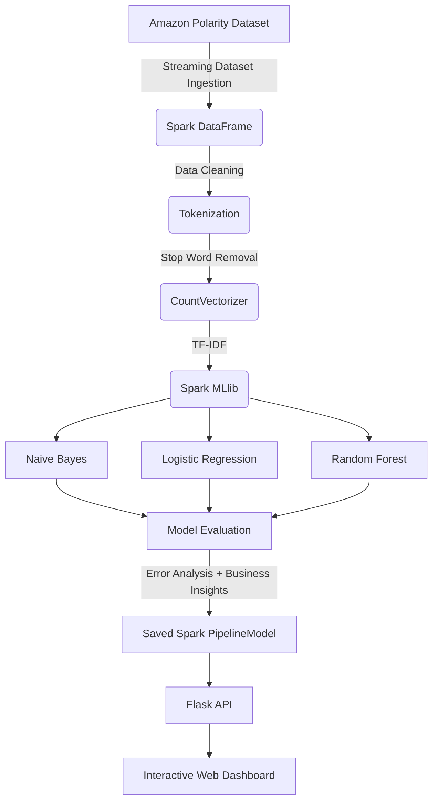
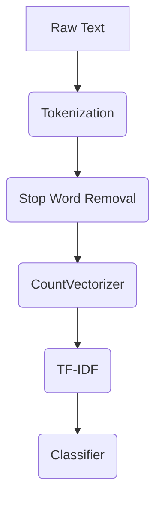

# Scalable Product Review Intelligence Using Apache Spark and Machine Learning

The project implements a scalable product-review sentiment classification and analytics system using Apache Spark and Spark MLlib.

The system processes a large Amazon Polarity review sample, performs distributed preprocessing and NLP feature extraction, trains multiple Spark MLlib classifiers, evaluates them using multiple metrics, performs error/business analysis, saves the best Spark PipelineModel, and exposes the trained model through a Flask API for live prediction.

## Project Architecture

### System Architecture



### ML Pipeline



## Project Structure

Current core project structure:

```
product-review-intelligence/
│
├── spark_pipeline.py
├── api.py
├── requirements.txt
├── results.json
├── saved_model/
│
└── results/
    └── figures/
        ├── model_accuracy_comparison.png
        ├── model_f1_comparison.png
        ├── model_roc_auc_comparison.png
        ├── model_train_time_comparison.png
        ├── sentiment_distribution.png
        ├── confusion_matrix_best_model.png
        ├── roc_curve_best_model.png
        ├── top_positive_terms.png
        └── top_negative_terms.png
```

## Dataset

Dataset: **Amazon Polarity**

Dataset is loaded using Hugging Face datasets with streaming:

```python
load_dataset("amazon_polarity", split="train", streaming=True)
```

**Current experiment:**
- 200,000 reviews sampled from the streaming dataset
- 168,676 reviews after cleaning/deduplication
- 80/20 train-test split
- random seed = 42

Amazon Polarity is a binary sentiment benchmark. The benchmark maps:
- 1–2 star reviews → Negative
- 4–5 star reviews → Positive
- 3-star reviews are excluded

## Spark Configuration

- `SparkSession`: `.master("local[*]")`
- Spark driver memory: `4g`
- Spark SQL shuffle partitions: `8`

`local[*]` uses the available local CPU cores for Spark execution, utilizing Spark DataFrames / MLlib for scalable processing. This is a distributed execution using Spark's execution model in local mode, rather than a production multi-node cluster deployment.

## Text Preprocessing

The preprocessing pipeline includes:

- **Remove missing reviews:** Ensures data integrity.
- **Remove duplicate reviews:** Prevents data leakage and bias.
- **Remove empty reviews:** Eliminates reviews with no content to analyze.
- **Convert text to lowercase:** Standardizes text format.
- **Remove non-alphanumeric characters:** Cleans punctuation and symbols.
- **Normalize whitespace:** Removes extra spaces.
- **Calculate review length:** Can be useful for feature engineering.

## Feature Engineering

**Unigram pipeline:**

Tokenizer → StopWordsRemover → CountVectorizer → IDF

CountVectorizer configuration:
- `vocabSize` = 20,000
- `minDF` = 2.0

The final TF-IDF vector is passed to the classifier.

**Unigram + Bigram pipeline:**

Additionally uses `NGram(n=2)` and combines unigram and bigram TF-IDF features using `VectorAssembler`. Unigram representations treat each word independently, whereas bigram representations capture pairs of adjacent words, allowing the model to recognize short phrases (like "not good").

## Machine Learning Models

The project evaluates:

1. Multinomial Naive Bayes
2. Logistic Regression
3. Random Forest

All models are implemented using Spark MLlib.

## Results

| Model | Feature Representation | Accuracy | Precision | Recall | F1 | ROC-AUC | Training Time | Prediction Time |
|---|---|---:|---:|---:|---:|---:|---:|---:|
| Naive Bayes | Unigram TF-IDF | 0.7767 | 0.7770 | 0.7767 | 0.7764 | 0.8541 | 1.56 s | 0.44 s |
| Logistic Regression | Unigram + Bigram TF-IDF | 0.7634 | 0.7636 | 0.7634 | 0.7634 | 0.8331 | 5.47 s | 0.62 s |
| Random Forest | Unigram + Bigram TF-IDF | 0.6376 | 0.7429 | 0.6376 | 0.5884 | 0.7800 | 71.44 s | 0.46 s |

**Selected model:** Multinomial Naive Bayes using Unigram TF-IDF.
This model was selected based on having the highest measured accuracy, highest measured ROC-AUC, and lowest training time among the evaluated models in the current experiment.

## Error Analysis

Test set findings:
- Test set: 33,410 reviews
- Correct predictions: 25,537
- Incorrect predictions: 7,873
- Overall error rate: 23.56%

Negation analysis:
- Negation-related reviews represented: 10.38% of test data
- Negation-related reviews represented: 16.02% of errors
- Negation-related error rate: 36.35%

This indicates a limitation of unigram-based representations: the model does not explicitly capture negation scope. For example, "not good" may be difficult for a simple unigram representation because word-level independence does not explicitly encode the relationship between "not" and "good."

## Business Analysis

Cleaned dataset distribution:
- Positive: 86,008 reviews (50.99%)
- Negative: 82,668 reviews (49.01%)

Important terms are extracted from model-derived feature weights to provide interpretability and business-level insight.

**Important positive terms:**
refreshing, marvelous, poignant, bravo, affordable, unforgettable, breathtaking

**Important negative terms:**
worthless, pathetic, disappointing, rubbish, dreadful, drivel, ripoff, letdown

## Visualization

| Figure | Description |
|---|---|
| `results/figures/model_accuracy_comparison.png` | Compares the accuracy of the evaluated models. |
| `results/figures/model_f1_comparison.png` | Compares the F1 scores of the evaluated models. |
| `results/figures/model_roc_auc_comparison.png` | Compares the ROC-AUC scores of the evaluated models. |
| `results/figures/model_train_time_comparison.png` | Compares the training times of the models. |
| `results/figures/sentiment_distribution.png` | Shows the distribution of positive and negative reviews in the dataset. |
| `results/figures/confusion_matrix_best_model.png` | Displays the confusion matrix for the selected best model. |
| `results/figures/roc_curve_best_model.png` | Shows the ROC curve for the selected best model. |
| `results/figures/top_positive_terms.png` | Visualizes the most important positive terms based on feature weights. |
| `results/figures/top_negative_terms.png` | Visualizes the most important negative terms based on feature weights. |

## Model Serving / API

The project includes an API (`api.py`) where the backend loads the saved Spark PipelineModel from `saved_model/` and provides live prediction.

**API Routes:**
- `GET /api/results`
- `POST /api/predict`

**Example POST Request:**
```json
{
  "review": "The product quality is excellent and I really enjoyed using it."
}
```

The backend applies the saved Spark preprocessing + feature pipeline before returning the prediction.

Example response structure — verify against api.py:
```json
{
  "sentiment": "POSITIVE",
  "confidence": 98.4,
  "prob_positive": 98.4,
  "prob_negative": 1.6,
  "model_used": "Multinomial Naive Bayes using Unigram TF-IDF"
}
```

## Dashboard

The dashboard is a custom web interface acting as an interactive project interface, built using:
- HTML5
- CSS3
- JavaScript ES6
- Chart.js
- Flask backend

The dashboard presents:
- project overview
- KPI/model results
- model comparison
- sentiment distribution
- ROC-AUC visualization
- confusion matrix
- training-time comparison
- positive/negative term analysis
- live sentiment prediction

## Why This Is a Big Data Project

This implementation satisfies the components of an academic Big Data / ML mini-project:

- **Dataset:** Large/appropriate dataset (Amazon Polarity).
- **Preprocessing:** Comprehensive text normalization and tokenization.
- **Spark distributed processing:** Execution in local mode utilizing multiple CPU cores.
- **Scalable MLlib algorithms:** Uses Spark's scalable machine learning library.
- **Evaluation:** Evaluated across multiple relevant metrics.
- **Visualization:** Extensive result visualization.
- **Performance analysis:** Empirical error and business analysis.

## Advanced Extensions / Future Scope

Potential extensions for future work:
- Aspect-Based Sentiment Analysis
- Topic Mining
- Explainable Predictions
- Review Intelligence Score
- Negation-aware preprocessing
- Larger-scale benchmarking
- Spark partition experiments
- Streaming review analytics
- Kafka integration
- cloud/cluster deployment

## Limitations

1. Current experiment uses 200,000 sampled reviews rather than the entire Amazon Polarity dataset.
2. Spark is configured in local[*] mode rather than a multi-node cluster.
3. Unigram TF-IDF has limited handling of negation.
4. Current classification is binary sentiment.
5. Amazon Polarity does not provide direct 1–5 star prediction in the current dataset representation.
6. Random Forest performed substantially worse in the current benchmark.
7. Advanced aspect/topic/streaming functionality should be treated as future extensions unless separately implemented.

## Installation

```bash
git clone <YOUR_GITHUB_REPOSITORY_URL>
cd <PROJECT_DIRECTORY>

python3 -m venv venv

# macOS/Linux:
source venv/bin/activate

# Windows:
venv\Scripts\activate

pip install -r requirements.txt
```

Apache Spark and a compatible Java environment may be required depending on the machine.

## Running the Project

### 1. Run the ML pipeline

```bash
python3 spark_pipeline.py
```

### 2. Start the API and Dashboard

```bash
python api.py
```
*(Also accessible via `python3 api.py`)*
