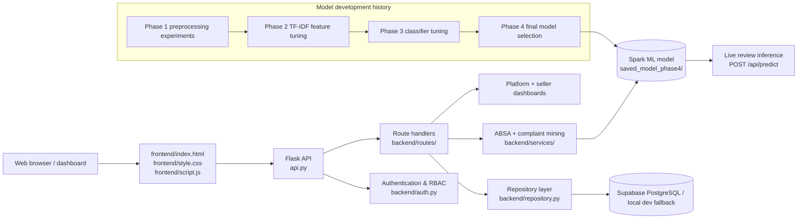

# ReviewIQ

ReviewIQ is a review intelligence platform for e-commerce platforms and seller organizations. It combines a Flask backend, a Supabase/PostgreSQL-ready data layer, and a Spark ML pipeline to analyze customer reviews, surface aspect-level sentiment, and expose tenant-aware dashboards for platform and seller users.

This repository contains the currently implemented application code rather than a purely experimental notebook workflow. The live app entry point is `api.py`, the main business logic sits under `backend/`, the ML pipeline and saved artifacts live under `pipeline/`, and the data model is defined in `supabase/migrations/`.

## Current implementation status

The current codebase includes:

- A Flask API with protected multi-tenant routes for authentication, products, reviews, platform dashboards, seller dashboards, and settings.
- JWT-based authentication and role enforcement in `backend/auth.py`.
- A database layer that supports Supabase PostgreSQL and a local/dev fallback path.
- Organization and product-level access control for `platform` and `seller` accounts.
- A live Spark pipeline model loaded from `saved_model_phase4/`.
- Aspect-based sentiment analysis and complaint mining services.
- A static frontend dashboard shell served by the Flask app.

This README describes what is implemented in the repository today. It does not describe a future roadmap or aspirational architecture unless a corresponding implementation already exists in the codebase.

---

## Architecture and repository layout

- `api.py` — Flask application entry point and live endpoints.
- `backend/` — auth, repository/data access, and route modules.
- `backend/services/absa.py` — aspect-based sentiment extraction.
- `backend/services/complaint_mining.py` — negative phrase and complaint mining logic.
- `pipeline/` — Spark preprocessing and experiment runners, plus saved model artifacts.
- `saved_model_phase4/` — current production model bundle used by the API.
- `supabase/migrations/` — actual schema and row-level security definitions.
- `frontend/` — static dashboard UI shell and client-side logic.
- `test/` — Python unittest coverage for auth, tenancy, and live prediction flows.

---

## System architecture


```mermaid
flowchart LR
    Browser[Web browser / dashboard] --> Frontend[frontend/index.html\nfrontend/style.css\nfrontend/script.js]
    Frontend --> API[Flask API\napi.py]
    API --> Auth[Authentication & RBAC\nbackend/auth.py]
    API --> Routes[Route handlers\nbackend/routes/]
    Routes --> Repo[Repository layer\nbackend/repository.py]
    Repo --> DB[(Supabase PostgreSQL / local dev fallback)]
    Routes --> Services[ABSA + complaint mining\nbackend/services/]
    Services --> Model[(Spark ML model\nsaved_model_phase4/)]
    Model --> Predict[Live review inference\nPOST /api/predict]
    Routes --> Dashboard[Platform + seller dashboards]

    subgraph ML[Model development history]
        P1[Phase 1 preprocessing experiments]
        P2[Phase 2 TF-IDF feature tuning]
        P3[Phase 3 classifier tuning]
        P4[Phase 4 final model selection]
    end

    P1 --> P2 --> P3 --> P4
    P4 --> Model
```

The application is organized around a single Flask service that handles auth, multi-tenant access control, product/review data access, and model inference. The ML pipeline is kept as a separate research and artifact layer that produces model files, evaluation summaries, and saved checkpoints used by the app at runtime.

---

## Experiment history and model development

The project includes a multi-phase experimental pipeline in `pipeline/` that tests text preprocessing, feature engineering, and classifier selection before the final model is saved for application use. All experiments run on the Amazon Polarity sample, use an 80/20 train/test split with seed 42, and record the same evaluation metrics: accuracy, precision, recall, F1, ROC-AUC, training time, and prediction time.

| Phase | Goal | Experiments | Key configuration | Result |
|---|---|---|---|---|
| Phase 1 | Preprocessing evaluation | A: baseline preprocessing; B: contraction expansion + preserved negations; C: contraction expansion + preserved negations + negation marking | Same dataset and logistic regression baseline; compare preprocessing choices only | Best result: Experiment C, which is the preprocessing used in later phases |
| Phase 2 | Feature engineering optimization | 1: baseline; 2: larger vocab; 3: 50k vocab + minDF=5; 4: 100k vocab + minDF=5; 5: trigram variation | Fixed preprocessing to Phase 1 best; vary TF-IDF vocab/minDF/ngram settings | Best result: unigram + bigram TF-IDF with 50k vocab and minDF=5 |
| Phase 3 | Classifier comparison | 3-A: LR baseline; 3-B: Naive Bayes; 3-C: LR tuned with TrainValidationSplit; 3-D: LinearSVC tuned; 3-E / 3-F: weighted variants if imbalance >5% | Same locked feature config from Phase 2; compare classifier families and tuning | Best result: LR tuned; class imbalance was below the threshold so weighted experiments were not needed |
| Phase 4 | Final model selection and deployment artifact | 4-A: LR baseline; 4-B: Naive Bayes; 4-C: LR tuned; 4-D: LinearSVC tuned; 4-E / 4-F: weighted variants if required | Same locked feature config, but additional phase-4 preparation combines `title` + `review` text for richer context | Best result: Tuned Logistic Regression with 90.55% accuracy and 0.9054 F1 |

### Phase 1 details

The first research phase compares three preprocessing strategies:

- Experiment A: baseline preprocessing
- Experiment B: contraction expansion and preserved negations
- Experiment C: contraction expansion, preserved negations, and explicit negation marking

This phase proves the importance of handling negation correctly. The project’s implementation uses `preprocess_variant_c` as the selected preprocessing pathway for downstream feature and model work.

### Phase 2 details

Phase 2 keeps preprocessing fixed and varies the TF-IDF representation. The project script tests:

- Unigram + bigram baseline
- Larger vocabulary sizes
- Higher minimum document frequency
- Trigram experimentation where feasible

The repository documents the best-performing configuration as:

- unigram + bigram TF-IDF
- vocabulary size of 50,000 for each n-gram family
- `minDF = 5.0`
- no sublinear TF because the underlying Spark MLlib implementation does not expose that parameter in this pipeline

This configuration becomes the locked feature representation used in later phases.

### Phase 3 details

Phase 3 changes only the classifier and hyperparameter tuning choices while keeping the Phase 2 feature setup constant.

The experiment set includes:

- 3-A: Logistic Regression baseline
- 3-B: Naive Bayes
- 3-C: Logistic Regression with TrainValidationSplit tuning
- 3-D: LinearSVC with TrainValidationSplit tuning
- 3-E and 3-F: weighted variants, only used if class balance exceeded 5%; this was not required because the class balance remained approximately balanced

The best-performing configuration in the project’s recorded results is the tuned logistic regression model.

### Phase 4 details

Phase 4 is the final model comparison and deployment artifact. It uses the same locked feature setup from Phase 2 and evaluates classifier choices against the same test split. The project also adds richer context by combining the review title and body before inference.

The final result recorded by the repository is:

- Model: Tuned Logistic Regression
- Accuracy: 0.9055 (90.55%)
- F1: 0.9054
- ROC-AUC: 0.9636
- Best saved model path: `saved_model_phase4/`

The code comments in the phase-4 runner refer to labels such as 3-A to 3-F, but the repository’s summary files and final production artifact use the phase-4 model as the final deployed pipeline.

---

## Product capabilities

### 1. Multi-tenant review intelligence

The app models two organization types:

- `platform` organizations: marketplace operators that can view aggregated intelligence across managed sellers.
- `seller` organizations: brands that can view only their own products and reviews.

The backend enforces this through server-side organization resolution and permission checks in `backend/auth.py` and the repository layer. The database schema also defines `platform_sellers` mapping records and `organization_members` role assignments.

### 2. Authentication and role enforcement

The current auth layer includes:

- JWT verification for bearer tokens.
- Local demo tokens for testing and demonstration flows.
- Role-based access control for `owner`, `admin`, `analyst`, and `viewer`.
- Server-side enforcement that prevents frontend-supplied organization IDs from being trusted.

The auth system explicitly distinguishes platform and seller authorization and rejects unauthorized cross-tenant access with 401 or 403 responses.

### 3. Product and review management

The repository includes data modeling for:

- organizations
- platform-to-seller relationships
- products
- datasets
- reviews
- analyses
- aspect results
- issue results
- user preferences
- audit logs

The actual schema is defined in `supabase/migrations/001_initial_schema.sql` and the row-level security policies are in `supabase/migrations/002_rls_policies.sql`.

### 4. Sentiment analysis and ABSA

The app loads a Spark-based sentiment pipeline from `saved_model_phase4/` and serves live review inference. The repository also includes aspect extraction via `backend/services/absa.py`, which identifies aspect phrases such as:

- Battery
- Build Quality
- Price / Value
- Customer Support
- Delivery / Packaging

### 5. Complaint mining and issue discovery

A separate complaint-mining service identifies negative phrases and organizes them into issue themes. The repository contains complaint mining code in `backend/services/complaint_mining.py` and result tables such as `issue_results` in the database schema.

### 6. Dashboard and reporting

The frontend shell is a static dashboard interface served by Flask. It is built around the actual backend metrics and analytics routes rather than a separate JavaScript application framework. The current project includes dashboard views for overview metrics, seller/platform intelligence, and review-level analysis.

---

## Verified model status

The live model used by the application is a saved Spark `PipelineModel` from `saved_model_phase4/`. It is a tuned logistic regression trained with the repository’s Phase 4 configuration.

Verified repository metrics from `results/phase4_summary.md`:

- Model: Tuned Logistic Regression
- Accuracy: 0.9055 (90.55%)
- F1: 0.9054
- ROC-AUC: 0.9636
- Dataset size: 100,000 rows (Amazon Polarity sample)
- Feature representation: unigram + bigram TF-IDF
- Train/test split: 80/20 with seed 42

The Phase 4 summary also records that the tuned model was selected after validation and then evaluated once on the untouched test set.

---

## Data and persistence model

The current repository is wired for a multi-tenant SaaS setup backed by Supabase PostgreSQL and ready for server-side auth. The core schema includes the following tables in the migration set:

- `profiles`
- `organizations`
- `organization_members`
- `platform_sellers`
- `organization_invitations`
- `products`
- `datasets`
- `reviews`
- `analyses`
- `aspect_results`
- `issue_results`
- `user_preferences`
- `audit_logs`

This is the actual implementation in the repo. The project also contains a SQLite/dev fallback path in the backend data layer, but the formal schema defined for the product is the Supabase/PostgreSQL design above.

---

## API surface

The current backend registers a set of authenticated endpoints. The main route groups are:

### Authentication and session

- `GET /api/config`
- `POST /api/auth/signup`
- `POST /api/auth/login`
- `GET /api/auth/me`
- `POST /api/auth/logout`

### Platform dashboard

- `GET /api/platform/overview`
- `GET /api/platform/sellers`
- `POST /api/platform/sellers`
- `GET /api/platform/sellers/<seller_id>`
- `GET /api/platform/analytics`

### Seller dashboard

- `GET /api/seller/overview`
- `GET /api/seller/analytics`

### Product operations

- `GET /api/products`
- `POST /api/products`
- `GET /api/products/<product_id>`

### Review operations

- `GET /api/reviews`
- `POST /api/reviews/upload`
- `POST /api/reviews/import`

### Settings and admin flows

- `GET /api/settings/team`
- `GET /api/settings/invitations`
- `POST /api/settings/invite`
- `GET /api/settings/audit`

### Live model inference and analytics

- `POST /api/predict`
- `GET /api/results`
- `GET /api/aspects`
- `GET /api/complaints`
- `GET /api/topics`
- `GET /api/dashboard`

In addition to these, the app serves the dashboard shell and auth pages from `api.py` and the static frontend files.

---

## Frontend and dashboard

The frontend is a static HTML/CSS/JavaScript dashboard served by Flask. The key app files are:

- `frontend/index.html`
- `frontend/style.css`
- `frontend/script.js`

This is a browser-based dashboard shell and client logic for the ReviewIQ app; it is not a separate React or Node service.

---

## Environment and local setup

### Prerequisites

- Python 3.9+
- Java installed for Spark-based local execution
- A configured `.env` file (optional for local demo mode, required for Supabase-backed flows)

### Install

```bash
git clone <repository-url>
cd <repository-folder>
python3 -m venv .venv
source .venv/bin/activate
pip install -r requirements.txt
cp .env.example .env
```

### Run the app

```bash
source .venv/bin/activate
python api.py
```

The app runs on the default Flask port and can be opened in a browser at the local endpoint created by the app (typically `http://localhost:5000`).

The repository also includes demo auth tokens in `backend/auth.py`, including platform and seller test tokens such as:

- `demo-platform-token`
- `demo-seller-aura-token`
- `demo-seller-aura-viewer-token`
- `demo-seller-lumina-token`

These are used for local testing and demonstrations.

---

## Testing

The repository includes a Python unittest suite under `test/` covering:

- unauthenticated request enforcement
- login and profile creation
- signup flow behavior
- organization access rules
- platform vs. seller isolation
- viewer role restrictions
- live prediction pipeline execution

The project is executed with:

```bash
source .venv/bin/activate
python -m unittest discover -s test -v
```

This repository currently contains a test suite with multiple checks in the current workspace. The actual execution in this environment discovered 17 tests and reported 1 failure and 1 error, so the suite is not currently described as fully passing in this README.

---

## Project notes and boundaries

The repository includes both application code and historical experimental artifacts:

- `pipeline/` contains the experiment scripts and result files used to compare different feature and model configurations.
- `saved_model_phase1/`, `saved_model_phase2/`, `saved_model_phase3/`, and `saved_model_phase4/` are model artifacts retained in the repo.
- The active app is wired to `saved_model_phase4/` via `api.py`.

This is important because the repo contains both a product/workflow layer and a research experiment layer. The product app is the API + backend + data model; the pipeline directories store the model development history.

---

## Summary

ReviewIQ is a working multi-tenant review analytics application with a live Spark ML inference path, an authenticated API, a product schema for multi-organization data, and a dashboard-oriented frontend. The current repository state is clearly far more than a one-off sentiment classifier: it implements a review intelligence platform with tenant separation, role enforcement, persisted analytics, and model-backed insight generation.
