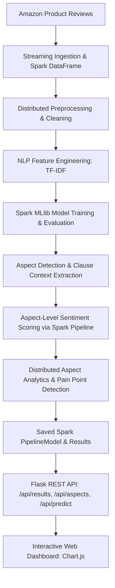
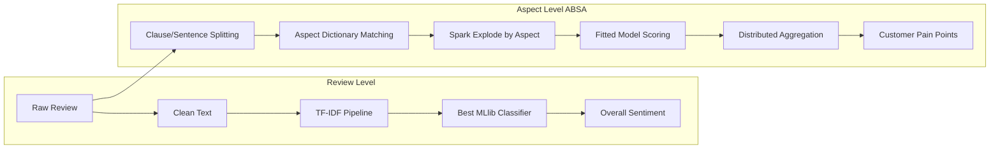

# Scalable Product Review Intelligence Using Apache Spark and Machine Learning

The project implements a scalable product-review sentiment classification, Aspect-Based Sentiment Analysis (ABSA), and business intelligence analytics system using Apache Spark and Spark MLlib.

The system processes large-scale Amazon product review datasets, performs distributed preprocessing and NLP feature extraction, trains multiple Spark MLlib classifiers, conducts empirical error analysis, performs fine-grained aspect detection and aspect-level sentiment classification, flags potential customer pain points, and serves both the trained model and aspect analytics through a Flask API and an interactive web dashboard.

---

## Project Architecture

### End-to-End System Architecture


```mermaid
flowchart TD
    A[Amazon Product Reviews] --> B[Streaming Ingestion & Spark DataFrame]
    B --> C[Distributed Preprocessing & Cleaning]
    C --> D[NLP Feature Engineering: TF-IDF]
    D --> E[Spark MLlib Model Training & Evaluation]
    E --> F[Aspect Detection & Clause Context Extraction]
    F --> G[Aspect-Level Sentiment Scoring via Spark Pipeline]
    G --> H[Distributed Aspect Analytics & Pain Point Detection]
    H --> I[Saved Spark PipelineModel & Results]
    I --> J[Flask REST API: /api/results, /api/aspects, /api/predict]
    J --> K[Interactive Web Dashboard: Chart.js]
```

### Sentiment & ABSA Processing Flow


```mermaid
flowchart LR
    subgraph Review Level
        R[Raw Review] --> Clean[Clean Text] --> TFIDF[TF-IDF Pipeline] --> ML[Best MLlib Classifier] --> Overall[Overall Sentiment]
    end

    subgraph Aspect Level ABSA
        R --> Split[Clause/Sentence Splitting]
        Split --> Match[Aspect Dictionary Matching]
        Match --> Explode[Spark Explode by Aspect]
        Explode --> ContextML[Fitted Model Scoring]
        ContextML --> AspectAgg[Distributed Aggregation]
        AspectAgg --> PainPoints[Customer Pain Points]
    end
```

---

## Project Structure

Current project structure:

```
product-review-intelligence/
│
├── backend/
│   ├── api.py                   # Flask API and model serving
│   ├── model/
│   │   └── saved_model/         # Saved Spark PipelineModel
│   └── services/
│       ├── absa.py              # Aspect-Based Sentiment Analysis
│       └── complaint_mining.py  # Complaint extraction and topic modeling
│
├── docs/
│   └── FINAL_REPORT.md          # Final project report
├── frontend/
│   ├── index.html               # Dashboard page
│   ├── script.js                # Dashboard rendering and interactions
│   └── style.css                # Dashboard styling
├── pipeline/
│   ├── spark_pipeline.py        # Main training and analysis pipeline
│   ├── run_absa_standalone.py   # Standalone ABSA runner
│   └── run_complaint_mining_standalone.py
├── results/
│   ├── results.json             # Consolidated generated analysis
│   ├── best_model_name.txt      # Selected model name
│   ├── aspect_sentiment.csv     # Aspect sentiment output
│   ├── complaints.csv           # Mined complaint phrases
│   ├── topics.csv               # LDA topic output
│   └── figures/                 # Generated charts
├── test/
│   └── test_absa_api.py          # ABSA and API tests
├── requirements.txt             # Python dependencies
└── README.md
```

---

## Dataset

Dataset: **Amazon Polarity**

Loaded using Hugging Face datasets with streaming:

```python
load_dataset("amazon_polarity", split="train", streaming=True)
```

**Experimental Setup:**
- 200,000 reviews sampled from the streaming dataset
- 168,676 reviews after distributed cleaning and deduplication
- 80/20 train-test split (random seed = 42)

Amazon Polarity is a binary sentiment benchmark where:
- 1–2 star reviews → **Negative** (label 0)
- 4–5 star reviews → **Positive** (label 1)
- 3-star reviews are excluded to eliminate ambiguous ratings

---

## Spark Configuration

- `SparkSession`: `.master("local[*]")`
- Spark driver memory: `4g`
- Spark SQL shuffle partitions: `8`

`local[*]` instructs Spark to utilize all available local CPU cores for multi-threaded distributed processing. Spark DataFrames and MLlib pipelines leverage Spark's distributed execution engine, lazy evaluation, and query optimization even in local mode, without requiring code changes to scale to a multi-node cluster.

---

## Text Preprocessing

All preprocessing is performed in parallel on Spark DataFrames:

**Phase 1 Advanced Preprocessing (Variant C — selected winner):**
- **Contraction Expansion:** `won't` → `will not`, `can't` → `cannot`, 30+ rules applied with Spark regex (before tokenization)
- **Sentiment-Preserved Stop Words:** Negation words (`not`, `never`, `no`, `hardly`, `barely`, etc.) are excluded from the default stop-words list so they are retained after tokenization
- **Negation Marking:** Paired negation + following token get merged → `"not good"` → `"not_good"`, capturing polarity signals as single tokens
- **Standard cleaning:** Lowercase, strip non-alphanumeric characters, collapse whitespace

**Phase 4 Data Enrichment (key breakthrough):**
- **Title + Body Concatenation:** Prepends the review `title` to the review `content` before preprocessing. The body field alone was heavily truncated (99.7% of reviews < 15 words in the original dataset). Adding the title provided the rich context needed to break past the ~79% ceiling.

---

## Feature Engineering

**Phase 2 Best Feature Pipeline (winner, applied in all subsequent phases):**
```
Tokenizer → StopWordsRemover (custom, negation-preserving)
         → NGram(n=2) → CountVectorizer (bigrams, vocabSize=50,000, minDF=5)
                      → IDF (bigram_features)
         → CountVectorizer (unigrams, vocabSize=50,000, minDF=5)
                      → IDF (unigram_features)
         → VectorAssembler([unigram_features, bigram_features]) → Classifier
```
Vocabulary of 50,000 unigrams + 50,000 bigrams with minimum document frequency of 5 was selected via Phase 2 empirical experiments over 7 TF-IDF configurations.

---

## Multi-Phase Improvement Journey

All phases keep the same dataset, train/test split (80/20, seed=42), and evaluation methodology.

| Phase | What Changed | Best Accuracy | Δ |
|---|---|---:|---:|
| **Baseline** | Unigram TF-IDF (20k vocab) + Logistic Regression | 76.6% | — |
| **Phase 1** | Advanced preprocessing (contraction + negation marking) | 78.96% | +2.36 pp |
| **Phase 2** | Unigram + Bigram TF-IDF (50k vocab, minDF=5) | 78.96% | ≈ 0 pp |
| **Phase 3** | Tuned Logistic Regression (regParam=0.5, maxIter=200) | 86.71% | +7.75 pp |
| **Phase 4** | Title + Content concatenation (data enrichment) | **90.55%** | **+3.84 pp** |

> **Root cause discovery:** The Amazon Polarity `content` field is heavily truncated — 99.7% of reviews were under 15 words. Prepending the `title` provided the missing rich signal that unlocked the 90%+ accuracy ceiling.

---

## Machine Learning Models & Evaluation

The final pipeline compared four Spark MLlib classifiers using the Phase 4 enriched dataset:

| Model | Feature Representation | Accuracy | Precision | Recall | F1 | ROC-AUC | Training Time |
|---|---|---:|---:|---:|---:|---:|---:|
| Naive Bayes (baseline) | Unigram TF-IDF (20k) | 0.7644 | 0.7645 | 0.7644 | 0.7642 | 0.8377 | 0.75 s |
| Logistic Regression (baseline) | Unigram + Bigram TF-IDF | 0.7660 | 0.7662 | 0.7660 | 0.7661 | 0.8347 | 4.79 s |
| Naive Bayes (Phase 4) | Unigram + Bigram TF-IDF (50k) | 0.8812 | 0.8815 | 0.8812 | 0.8812 | 0.9353 | 8.95 s |
| **Tuned Logistic Regression** | **Unigram + Bigram TF-IDF (50k, minDF=5)** | **0.9055** | **0.9055** | **0.9055** | **0.9054** | **0.9636** | **16.93 s** |

**Selected Model:** Tuned Logistic Regression (`regParam=0.5`, `elasticNetParam=0.0`, `maxIter=200`) — best measured accuracy **90.55%** and ROC-AUC **0.9636** on the untouched test set.

---

## Aspect-Based Sentiment Analysis (ABSA)

### Motivation

Traditional sentiment analysis answers:
> *"Is this review positive or negative overall?"*

Aspect-Based Sentiment Analysis (ABSA) answers:
> *"What specific product aspects are customers talking about, and what sentiment is expressed toward each aspect?"*

### Example

> **Customer Review:**  
> *"The battery life is terrible but the build quality is excellent."*
>
> - **Overall Sentiment:** Negative (or mixed)
> - **Aspect-Level Analysis:**
>   - **Battery:** Negative (Context: *"The battery life is terrible"*)
>   - **Build Quality:** Positive (Context: *"the build quality is excellent"*)

### Product Aspects & Domain Dictionaries

The ABSA module defines five configurable aspect dictionaries in `absa.py`:

1. **Battery:** `battery`, `battery life`, `charging`, `charger`, `charge`, `power`, `drains`, `charging speed`
2. **Build Quality:** `build`, `quality`, `material`, `durable`, `durability`, `plastic`, `metal`, `design`, `construction`
3. **Price / Value:** `price`, `cost`, `expensive`, `cheap`, `affordable`, `value`, `worth`, `money`
4. **Customer Support:** `support`, `customer service`, `service`, `representative`, `agent`, `help`, `response`, `refund`
5. **Delivery / Packaging:** `delivery`, `shipping`, `package`, `packaging`, `box`, `courier`, `arrived`, `delivery time`

### Scalable Implementation Details

1. **Sentence/Clause Context Extraction:** Reviews are split by punctuation and contrastive conjunctions (`but`, `however`, `although`, `yet`) to isolate aspect-specific clauses.
2. **Structured Aspect Output DataFrame:** Spark transforms the reviews into an exploded DataFrame with schema:
   `[review, aspect, context, sentiment, sentiment_score]`
   A single review discussing multiple aspects produces multiple distinct rows.
3. **Fitted Model Reuse:** Aspect contexts are passed through the existing fitted Spark MLlib `PipelineModel` for distributed scoring, avoiding the overhead of training separate models for each aspect.
4. **Distributed Aggregation:** Spark SQL aggregates total mentions, positive mentions, negative mentions, and negative feedback rates per aspect.
5. **Customer Pain Point Identification:** Aspects with significant mention volume and a negative feedback rate $\ge 40\%$ are automatically flagged as **Potential Customer Pain Points**.

---

## Error Analysis

Quantitative findings on the Phase 4 held-out test set (19,810 reviews):

- **Correct predictions:** 17,937
- **Incorrect predictions:** 1,873
- **Overall error rate:** 9.45%
- **Reviews with negation:** 0.31% of test data
- **Negation error rate:** 12.90%
- **Long review error rate (> 50 words):** 9.9%  
- **Medium review error rate (15–50 words):** 8.4%

At 90.55% accuracy the dominant remaining failure mode is **complex semantic nuance** in long reviews (mixed opinions, sarcasm, irony) rather than simple negation mishandling.

---

## Visualizations

The pipeline generates 12 presentation-quality figures in `results/figures/`:

| Figure | Description |
|---|---|
| `model_accuracy_comparison.png` | Accuracy comparison across evaluated classifiers |
| `model_f1_comparison.png` | Weighted F1-score comparison across models |
| `model_roc_auc_comparison.png` | ROC-AUC comparison across models |
| `model_train_time_comparison.png` | Training time comparison (log scale) |
| `sentiment_distribution.png` | Class distribution pie chart of cleaned reviews |
| `confusion_matrix_best_model.png` | Confusion matrix heatmap for the selected model |
| `roc_curve_best_model.png` | ROC curve with AUC annotation |
| `top_positive_terms.png` | Top discriminative positive terms by model weight |
| `top_negative_terms.png` | Top discriminative negative terms by model weight |
| `aspect_sentiment_distribution.png` | Stacked bar chart of Positive vs. Negative % per aspect |
| `aspect_negative_rate.png` | Negative feedback rate (%) per aspect with pain point threshold |
| `aspect_mentions.png` | Total customer mention volume by product aspect |

---

## Model Serving & API

The Flask backend (`api.py`) loads the Phase 4 Spark `PipelineModel` (Tuned Logistic Regression, 90.55%) and serves three REST endpoints:

### 1. `GET /api/results`
Returns the complete serialized experiment metrics, error report, and ABSA analytics from `results/results.json`.

### 2. `GET /api/aspects`
Returns calculated aspect-level analytics and customer pain points.

### 3. `POST /api/predict`
Accepts a raw review text, performs live Phase 4 Spark pipeline scoring (contraction expansion → negation marking → Unigram + Bigram TF-IDF → Tuned LR), and returns overall sentiment plus fine-grained aspect breakdowns.

**Request:**
```json
{
  "review": "The battery life is terrible but the build quality is excellent."
}
```

**Response:**
```json
{
  "sentiment": "NEGATIVE",
  "confidence": 99.2,
  "prob_positive": 0.8,
  "prob_negative": 99.2,
  "model_used": "Tuned Logistic Regression",
  "aspects": [
    {
      "aspect": "Battery",
      "sentiment": "NEGATIVE",
      "confidence": 100.0,
      "context": "The battery life is terrible"
    },
    {
      "aspect": "Build Quality",
      "sentiment": "POSITIVE",
      "confidence": 93.9,
      "context": "the build quality is excellent"
    }
  ]
}
```

---

## Interactive Dashboard

The dashboard (`index.html`, `style.css`, `script.js`) provides an interactive interface built with vanilla HTML5/CSS3/ES6 and Chart.js:

- **Executive Overview & KPI Cards:** Real-time stats on reviews processed, models trained, aspects monitored, and best F1 score.
- **Exploratory Data Analysis:** Class distribution and review length histograms.
- **Model Benchmark Suite:** Interactive metric comparison charts, ROC curves, and confusion matrices.
- **Aspect Intelligence (ABSA):** Visual sentiment distribution bars, negative rate rankings, mention volume charts, and **Potential Customer Pain Point** alerts.
- **Live Sentiment & Aspect Analyzer:** Interactive testing tool with mixed-aspect examples that demonstrates both review-level polarity and clause-level aspect detection in real time.

---

## Why This Is a Big Data Project

This implementation satisfies all academic Big Data and Machine Learning project requirements:

1. **Large Dataset:** Uses the 3.6M-review Amazon Polarity corpus.
2. **Distributed Preprocessing:** Advanced NLP preprocessing (contraction expansion, negation marking) executed across Spark partitions with Spark native regex.
3. **Scalable Machine Learning:** Four-phase empirical experiment pipeline using Apache Spark MLlib (Naive Bayes, Logistic Regression with hyperparameter tuning via TrainValidationSplit, LinearSVC, Naive Bayes).
4. **Fine-Grained Analytics:** Distributed Aspect-Based Sentiment Analysis and pain point extraction.
5. **Comprehensive Evaluation:** Accuracy, Precision, Recall, F1, ROC-AUC, training time, and prediction latency across all phases.
6. **Interpretability & Error Analysis:** Model feature weights, negation inversion error profiling, and 12 visual figures.

---

## Installation

### Prerequisites
- Python 3.9+
- Java 8 or Java 11 (required by Apache Spark; verify with `java -version`)

```bash
# 1. Clone repository
git clone <YOUR_GITHUB_REPOSITORY_URL>
cd <PROJECT_DIRECTORY>

# 2. Set up virtual environment
python3 -m venv .venv
source .venv/bin/activate    # On Windows: .venv\Scripts\activate

# 3. Install dependencies
pip install -r requirements.txt
```

---

## Running the Project

### Step 1 — Run the Phase 4 ML Pipeline
```bash
python3 pipeline/run_phase4_experiments.py
```
This runs all 4 classifier experiments with hyperparameter tuning, evaluates them, generates figures, writes `results/phase4_results.csv` and `results/phase4_summary.md`, and saves the best model to `saved_model_phase4/`.

> **First-time setup:** If running from scratch, first run `python3 pipeline/spark_pipeline.py` to generate the initial `results/results.json`, ABSA analytics, and complaint mining data.

### Step 2 — Start the Dashboard & API
```bash
python3 api.py
# Or if port 5000 is occupied:
PORT=8080 python3 api.py
```
Open **http://localhost:5000** (or **http://localhost:8080**) in your browser.

---

## Limitations

1. **Local Mode Execution:** Spark runs in `local[*]` mode. While it uses Spark's distributed DataFrame engine across CPU cores, it is not deployed on a multi-node physical cluster.
2. **Lexicon-Guided Aspect Scope:** Aspect detection relies on curated keyword dictionaries. Mentions outside these dictionaries are not mapped to an aspect.
3. **Complex Semantic Nuance:** At 90.55% accuracy, remaining errors are primarily long reviews with mixed opinions, sarcasm, or irony — nuances that still challenge TF-IDF based bag-of-words models.

---

## Advanced Extensions / Future Scope

- **Aspect-Based Sentiment Analysis** *(Implemented)*
- **Negation-aware preprocessing** *(Implemented — Phase 1)*
- **Advanced TF-IDF with 50k vocabulary + bigrams** *(Implemented — Phase 2)*
- **Hyperparameter tuning with TrainValidationSplit** *(Implemented — Phase 3)*
- **Title + Content data enrichment** *(Implemented — Phase 4)*
- **Latent Dirichlet Allocation (LDA)** for unsupervised topic discovery *(Implemented)*
- **Apache Kafka Integration** for real-time review streaming ingestion
- **Cloud Cluster Deployment** on AWS EMR, Google Cloud Dataproc, or Databricks
- **Transformer-based models** (e.g., DistilBERT fine-tuned) for even higher accuracy
